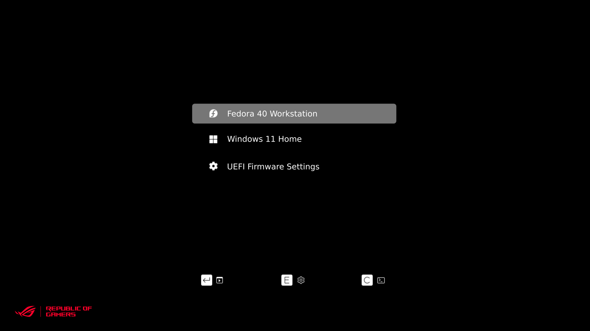

# Minimalist Grub2 theme with ROG logo

## Preview

## How to install

Open a terminal cd'd to the directory of the source code, and run the following commands:

`sudo chmod +x install.sh`

`sudo ./install.sh -s <screen-size>`

#### Screen size:

- 1920x1080 - 1080p
- 2560x1440 - 2k
- 3840x2160 - 4k
- 2560x1080 - ultrawide
- 3440x1440 - ultrawide2k

#### Examples:

If your monitor is of the resolution 2560x1440:

`sudo ./install.sh -s 2k`

To remove the theme:

`sudo ./install.sh -r`

To open the help menu:

`sudo ./install.sh -h`

## Notes

Only 2k resolution has been tested, other resolutions may or may not work. If you have tested any of them and they work fine, message me.

## Credits

Based on [vinceliuice's grub2-themes](https://github.com/vinceliuice/grub2-themes).

Inspired from [thekarananand's ROG Grub theme](https://github.com/thekarananand/ROG_GRUB_Theme).

Logo © ASUS.
