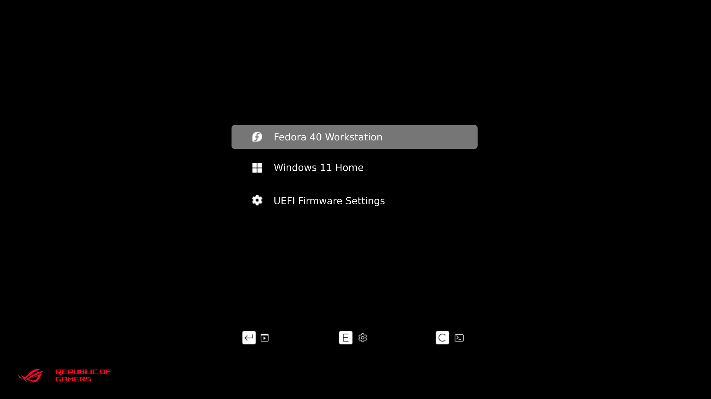

# Minimal ROG theme for GRUB/GRUB2



## Safety model

The installer is intentionally narrow:

- changes only `GRUB_THEME` in `/etc/default/grub`;
- does not change `GRUB_BACKGROUND`, `GRUB_GFXMODE`, terminal settings, EFI entries, or partitions;
- never asks for a password itself or installs packages;
- generates and syntax-checks a candidate GRUB configuration before applying it;
- keeps unique rollback snapshots under `/var/lib/min-rog-grub/backups/`;
- records and restores the previously active theme line on removal;
- leaves an unrelated active theme untouched;
- stages theme assets and restores the previous directory if replacement fails.

Review the script and pin the Git revision before running it as root.

## Install

Clone the repository and select the desired revision:

```bash
git clone https://github.com/chocobot-farm/rog-grub.git
cd rog-grub
git checkout <reviewed-commit>
```

For predictable early-boot availability, install the assets under `/boot/grub/themes` (or `/boot/grub2/themes`, detected automatically):

```bash
sudo ./install.sh --boot --screen 2k
```

Without `--boot`, assets are installed under `/usr/share/grub/themes`:

```bash
sudo ./install.sh --screen 2k
```

### Screen variants

| Resolution | Variant |
| --- | --- |
| 1920×1080 | `1080p` |
| 2560×1440 | `2k` |
| 3840×2160 | `4k` |
| 2560×1080 | `ultrawide` |
| 3440×1440 | `ultrawide2k` |

## Generate assets without changing GRUB

This action does not require root and does not edit GRUB configuration:

```bash
./install.sh --generate /tmp/rog-grub-preview --screen 4k
```

The generated runtime theme will be in `/tmp/rog-grub-preview/min_rog`.

## Remove

Use the same command regardless of whether installation used `--boot`; the installer records the actual asset directory:

```bash
sudo ./install.sh --remove
```

Removal restores the theme line that was active before the first managed installation. If another theme is currently active, its configuration is preserved.

Rollback snapshots are retained under `/var/lib/min-rog-grub/backups/` for manual recovery.

## Test

```bash
bash -n install.sh tests/install_test.sh
bash tests/install_test.sh
```

## Credits

Based on [vinceliuice's grub2-themes](https://github.com/vinceliuice/grub2-themes).

Inspired by [thekarananand's ROG GRUB theme](https://github.com/thekarananand/ROG_GRUB_Theme).

Logo © ASUSTeK Computer Inc.
